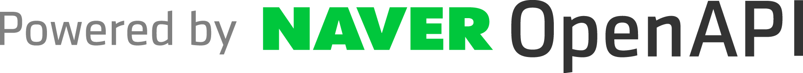

# SalmonBot
연어봇 - SalmonBot

웹의 모든것을, 디스코드에서.
Everything on the web, in Discord.

## Licence
To use my code, follow this [Licence](LICENSE)

## How to Use
### Requirements
|    NAME    |    DEVELOP VERSION    |
|------------|-----------------------|
| Python3    | 3.7.6                 |
| MariaDB    | 10.0.28-MariaDB       |

|   PAKAGE   |  VERSION  |
|----------- |-----------|
| discord.py | 1.3.2     |
| Paramiko   | 2.7.1     |
| Requests   | 2.21.0    |
| PyMySQL    | 0.9.3     |

## Developer

 by ArpaAP, in InfiniteTeam

 by COiN, in InfiniteTeam

## OpenAPIs

 

